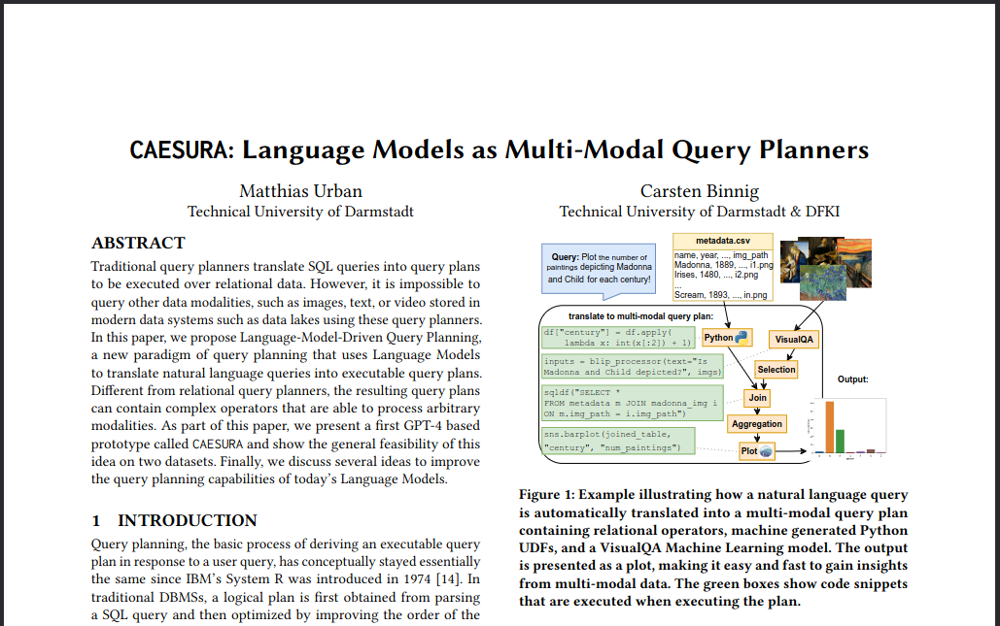

# CAESURA: Language Models as Multi-Modal Query Planners

CAESURA is a LLM-driven query planner for multi-modal data systems. This is the implementation described in

> Matthias Urban and Carsten Binnig: "CAESURA: Language Models as Multi-Modal Query Planners", CIDR'2024 [[PDF]](https://www.cidrdb.org/cidr2024/papers/p14-urban.pdf).
> 
> 

## Setup

1. **Install CAESURA. Tested with python3.11.2 and conda on Ubuntu.**

    ```sh
    git clone git@github.com:DataManagementLab/caesura.git
    cd caesura
    conda create -n caesura
    conda activate caesura
    conda install python=3.11 pip
    pip install -r requirements.txt
    pip install -e .
    ```

1. **Install Pytorch: https://pytorch.org/ -- Tested with torch==2.0.0, torchvision==0.15.1**

1. **Get the datasets**

    1. **Generate the Rotowire Dataset (Wiseman et al, 2017).**

        ```sh
        python scripts/rotowire/download.py
        ```

        Manually fix the dataset in datasets/rotowire/players.csv and datasets/rotowire/teams.csv. Look out for [[ and {{. For correct results also check whether heights are all given in feet, and so on.

    1. **Get the artworks/museum dataset.**

        ```sh
        python scripts/artworks/download.py  # Full dataset
        python scripts/artworks/download.py 100 # Only first 100 artworks 
        ```

1. **Test it on your own queries.**

    ```sh
    python caesura/main.py
    ```

1. **Run the experiments.**

    ```sh
    python scripts/run_experiment.py --model=3  # GPT-3
    python scripts/run_experiment.py --model=4  # GPT-4
    ```

    <details>
        <summary>Queries we used for our evaluation</summary>

        To get the same queries as in the paper, run the above command once. Afterwards open scripts/run_experiment.py and uncomment lines 14-39. Then run again.

        1. What is the newest painting in the database? (artwork)
        2. What is the genre of the newest painting in the database? (artwork)
        3. Get the century of the newest painting per movement (artwork)
        4. Get the number of paintings for each century (artwork)
        5. Plot the year of the oldest painting per genre (artwork)
        6. Plot the number of paintings for each century (artwork)
        7. What is depicted on the oldest Renaissance painting in the database? (artwork)
        8. What is the movement of the painting that depicts the highest number of babies? (artwork)
        9. Get the highest number of swords depicted in paintings of each genre (artwork)
        10. Get the number of paintings that depict Animals for each movement (artwork)
        11. Plot the lowest number of swords depicted in each genre (artwork)
        12. Plot the number of paintings that depict War for each century (artwork)
        13. Who is the smallest power forward in the database? (rotowire)
        14. What is the youngest team in the Southeast Division in terms of the founding date? (rotowire)
        15. Who is the oldest player per nationality? (rotowire)
        16. What is the oldest team per conference in terms of the founding date? (rotowire)
        17. Plot the age of the youngest player per position (rotowire)
        18. Plot the age of the oldest team per conference in terms of the founding date (rotowire)
        19. Who made the lowest number of assists in any game? (rotowire)
        20. Which team made the highest percentage of field goals in any game? (rotowire)
        21. For each player, what is the highest number of assists they made in a game? (rotowire)
        22. How many games did each team loose? (rotowire)
        23. Plot the highest number of three pointers made by players from each nationality (rotowire)
        24. Plot the  lowest percentage of field goals made by teams from each division (rotowire)
        25. What is the oldest impressionist artwork in the database? (artwork)
        26. What is the genre of the oldest painting in the database? (artwork)
        27. Get the century of the newest painting per genre (artwork)
        28. Get the number of paintings for each year (artwork)
        29. Plot the year of the oldest painting per movement (artwork)
        30. Plot the number of paintings for each year (artwork)
        31. What is depicted on the oldest religious artwork in the database? (artwork)
        32. What is the movement of the painting that depicts the highest number of swords? (artwork)
        33. Get the highest number of swords depicted in paintings of each movement (artwork)
        34. Get the number of paintings that depict Fruit for each century (artwork)
        35. Plot the lowest number of swords depicted in each year (artwork)
        36. Plot the number of paintings that depict War for each year (artwork)
        37. Who is the smallest small forward in the database? (rotowire)
        38. What is the youngest team in the Western conference in terms of the founding date? (rotowire)
        39. Who is the oldest player per position? (rotowire)
        40. What is the oldest team per division in terms of the founding date (rotowire)
        41. Plot the age of the oldest player per nationality (rotowire)
        42. Plot the age of the youngest team per division in terms of the founding date (rotowire)
        43. Who made the lowest number of points in any game? (rotowire)
        44. Which team made the lowest number of total points in any game? (rotowire)
        45. For each player, what is the highest number of field goals they made in a game? (rotowire)
        46. How many games did each team win? (rotowire)
        47. Plot the lowest number of rebounds made by players from each nationality (rotowire)
        48. Plot the  highest percentage of field goals made by teams from each division (rotowire)       
    </details>

## Reference

If you use the code or the benchmarks of this repository then please cite our paper:

```bib
@inproceedings{caesura,
  author       = {Matthias Urban and Carsten Binnig},
  title        = {CAESURA: Language Models as Multi-Modal Query Planners},
  booktitle    = {14th Conference on Innovative Data Systems Research, {CIDR} 2024,
                  Chaminade, CA, USA, January 14-17, 2024},
  publisher    = {www.cidrdb.org},
  year         = {2024},
  url          = {https://www.cidrdb.org/cidr2024/papers/p14-urban.pdf}
}

```
